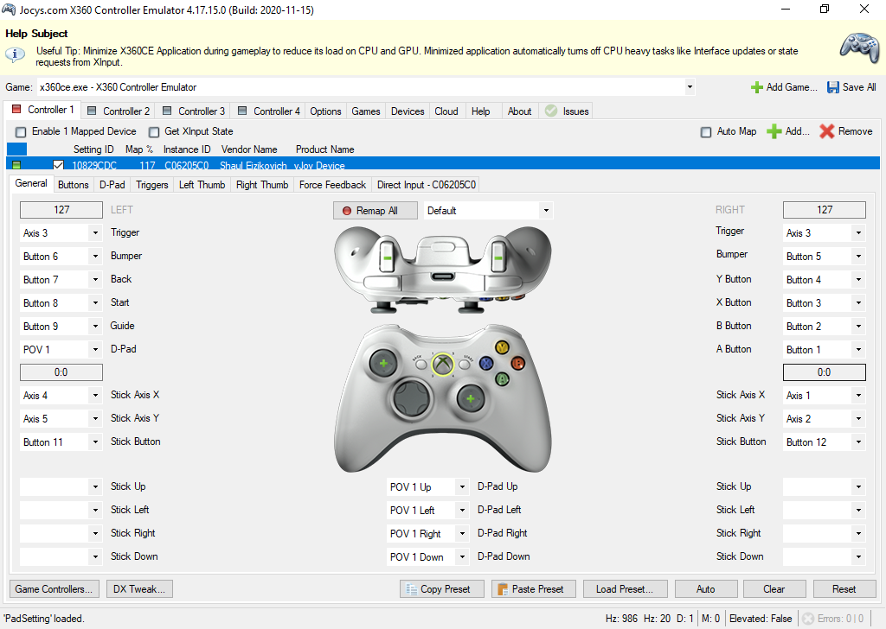

# Simulate XBox Controller Input with Python

Based on https://stackoverflow.com/questions/43483121/simulate-xbox-controller-input-with-python

### Steps:
1. Install vJoy and config (http://vjoystick.sourceforge.net/site/)

2. Create a project with PyCharm and install pyvJoy
3. Test buttons ans joysticks in python terminal
4. Open xbox360ce and config like see in image

### Purpose:
Make some kind of control over a game from which we can obtain feedback information, either via OpenCV or because the game has some feedback over UDP. For example, the type of control can be with an AI or PID or predictive control.

### Why not use vJoy directly?
Because XBOX Controller is highly compatible with a lot of game of PC.